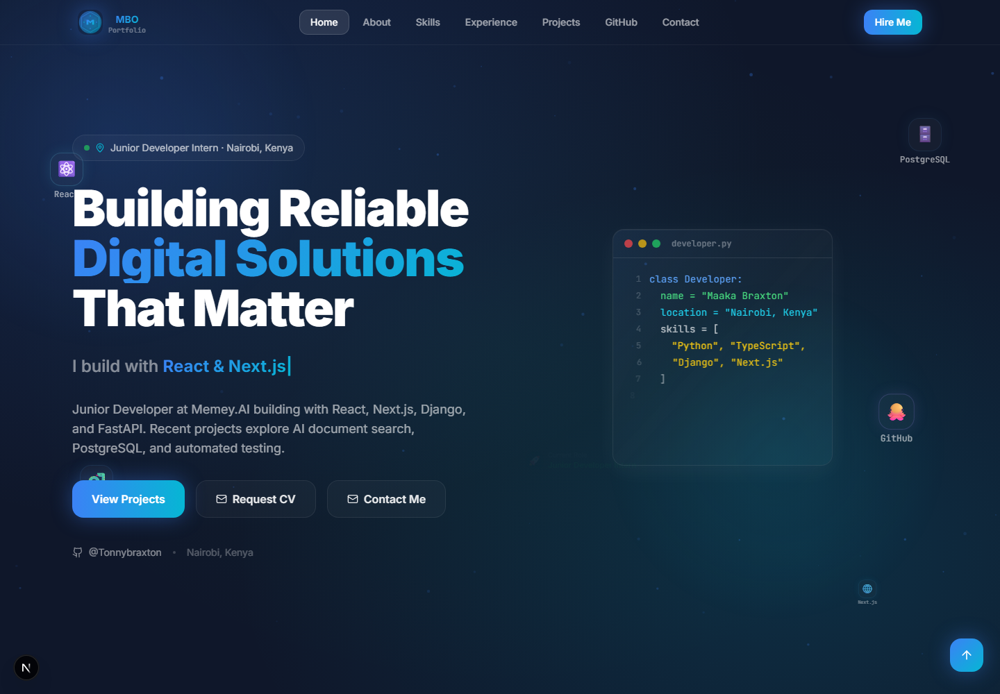

# Maaka Braxton Orioki — Portfolio Website

A personal portfolio website built with **Next.js 16**, **TypeScript**, **Tailwind CSS**, and **Framer Motion**.

## Preview



## 🚀 Features

- **Ultra-modern UI** — Glassmorphism, floating gradients, mouse-glow effects
- **Animated sections** — Hero particles, typewriter, 3D tilt cards, skill bars
- **GitHub integration** — Live repos, stats, language distribution (cached hourly)
- **Dark mode** — Sleek `#0F172A` dark-mode-first design
- **Mobile responsive** — Optimized for all screen sizes
- **SEO optimized** — Metadata, Open Graph, sitemap, robots.txt
- **Performance** — Dynamic imports, image optimization, ISR caching

## 🛠️ Tech Stack

| Technology | Purpose |
|------------|---------|
| Next.js 15 | Framework + SSR/SSG |
| TypeScript | Type safety |
| Tailwind CSS | Styling |
| Framer Motion | Animations |
| Lucide Icons | Iconography |
| GitHub API | Live repository data |
| next/font | Google Fonts (Inter, JetBrains Mono) |

## 📁 Project Structure

```
src/
├── app/
│   ├── layout.tsx          # Root layout, SEO metadata
│   ├── page.tsx            # Main page
│   ├── globals.css         # Global styles
│   ├── sitemap.ts          # Auto-generated sitemap
│   ├── robots.ts           # Robots.txt
│   └── api/github/         # GitHub API proxy route
├── components/
│   ├── sections/
│   │   ├── Hero.tsx        # Full-screen hero
│   │   ├── About.tsx       # About + stats + timeline
│   │   ├── Skills.tsx      # Skills with bars + rings
│   │   ├── Experience.tsx  # Work experience timeline
│   │   ├── Projects.tsx    # Project cards with 3D tilt
│   │   ├── GitHub.tsx      # Live GitHub data
│   │   └── Contact.tsx     # Contact form
│   └── ui/
│       ├── Navbar.tsx      # Sticky glassmorphic navbar
│       ├── Footer.tsx      # Footer with back-to-top
│       └── CursorGlow.tsx  # Mouse-following glow
└── lib/
    ├── constants.ts        # All personal data
    ├── github.ts           # GitHub API utilities
    └── utils.ts            # Helper functions
```

## ⚡ Getting Started

### Prerequisites
- Node.js 18+
- npm or yarn

### Installation

```bash
# Install dependencies
npm install

# Start development server
npm run dev
```

Open [http://localhost:3000](http://localhost:3000) to view the portfolio.

### Build for Production

```bash
npm run build
npm start
```

## 🌐 Deployment

### Vercel (Recommended)

```bash
# Install Vercel CLI
npm i -g vercel

# Deploy
vercel
```

### Environment Variables (Optional)

Create `.env.local` for a GitHub token to increase API rate limits:

```env
GITHUB_TOKEN=your_github_personal_access_token
```

## 📞 Contact

**Maaka Braxton Orioki**
- 📧 [braxtonmaaka1@gmail.com](mailto:braxtonmaaka1@gmail.com)
- 🐙 [github.com/Tonnybraxton](https://github.com/Tonnybraxton)
- 📍 Nairobi, Kenya

---

Built with ❤️ in Nairobi · © 2024 Maaka Braxton Orioki
